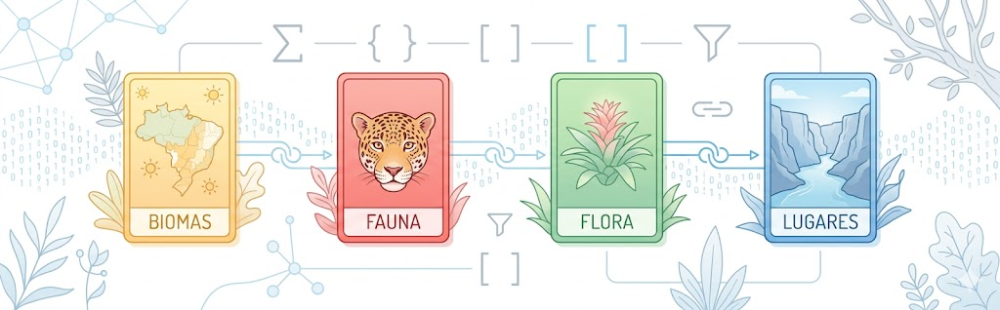

# EcoDex: Desvendando os ecossistemas brasileiros com lógica de dados

## Apresentação

 Uma atividade de computação desplugada com uso de cartas para introduzir conceitos de bancos de dados relacionais por meio da biodiversidade dos biomas brasileiros. 

 

### Disciplinas e conteúdos relacionados 

* **Biologia:** cadeias e teias alimentares, hábitos alimentares, e interações entre seres vivos e fatores abióticos; conservação de espécies e impactos das atividades antrópicas na perda de habitats; adaptações morfológicas e fisiológicas da flora e da fauna aos diferentes ecossistemas.

* **Geografia:** características físicas das grandes paisagens naturais brasileiras (Amazônia, Cerrado, Caatinga, Mata Atlântica, Pampa); localização, distribuição espacial, fronteiras e regionalização do território brasileiro; turismo sustentável, ecoturismo e a interação socioespacial com o patrimônio histórico-cultural e arqueológico brasileiro.

* **Computação:** banco de dados relacionais, tabelas (entidades), atributos (campos), chaves primárias e estrangeiras, filtros de seleção textual e numérica (`WHERE`), operadores lógicos (`AND`, `OR`, `NOT`), funções de agregação (`COUNT`), agrupamento de dados (`GROUP BY`), e junção de dados/tabelas baseada em correspondência de strings (JOIN).

### Habilidades

* **Ciências da Natureza e suas Tecnologias (EM13CNT301):** Construir questões, elaborar hipóteses, previsões e estimativas, empregar instrumentos de medição e representar e interpretar modelos explicativos, dados e/ou resultados experimentais para construir, avaliar e justificar conclusões no enfrentamento de situações-problema sob uma perspectiva científica.

* **Ciências Humanas e Sociais Aplicadas (EM13CHS204):** Comparar e avaliar os processos de ocupação do espaço e a formação de territórios, territorialidades e fronteiras, identificando o papel de diferentes agentes (como grupos sociais e culturais, impérios, Estados Nacionais e organismos internacionais) e considerando os conflitos populacionais (internos e externos), a diversidade étnico-cultural e as características socioeconômicas, políticas e tecnológicas.

* **Computação (EM13CO12):** Produzir, analisar, gerir e compartilhar informações a partir de dados, utilizando princípios de ciência de dados.

* **Computação (EM13CO13):** Analisar e utilizar as diferentes formas de representação e consulta a dados em formato digital para pesquisas científicas.

### Nível de ensino

Ensino Médio e Educação profissional ou tecnológica.

### Materiais Necessários

Cada grupo de alunos precisará de:
* **1 Baralho EcoDex** impresso e recortado (composto por 80 cartas divididas em 4 categorias de cores):
  
    * 🟩 **Cartas Verdes:** Plantas (Flora)
  
    * 🟥 **Cartas Vermelhas:** Animais (Fauna)
  
    * 🟦 **Cartas Azuis:** Lugares (Paisagens naturais)

    * 🟨 **Cartas Amarelas:** Biomas Brasileiros

O professor precisará de:

* **1 Listagem de desafios:** que pode ser impressa ou digital, cada pergunta/desfio pode ser feita oralmente, escrita em quadro ou projetada digitalmente.

* **1 Cronômetro**: que pode ser o do celular do professor.

> *Os arquivos do baralho EcoDex (prontos para impressão) e o arquivo aberto (CSV) para personalização das cartas estão disponíveis na pasta `/src` e `/data` deste repositório.*

## EcoDex

## Licença

Este projeto está sob a licença **Creative Commons Attribution-NonCommercial-ShareAlike 4.0 International (CC BY-NC-SA 4.0)**. Você pode compartilhar, adaptar e usar para fins educativos não comerciais, desde que atribua os créditos e compartilhe sob a mesma licença.